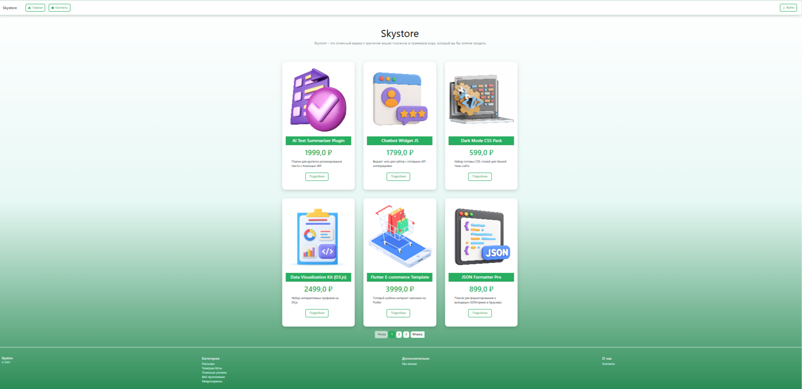
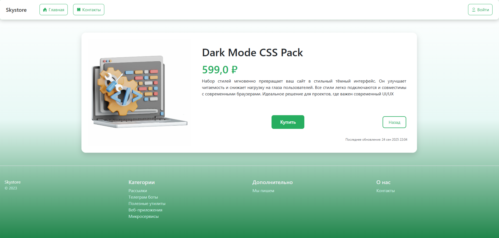
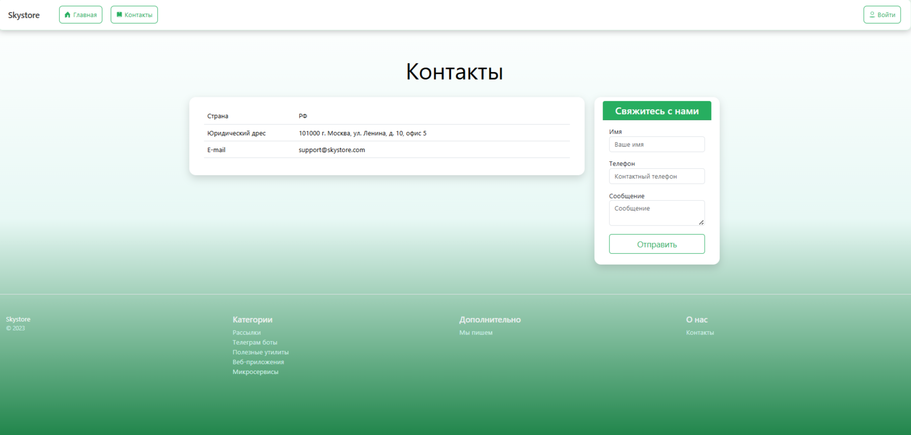

# Проект "Ecommerce_app"

## Описание:

"Ecommerce_app" является учебным проектом по Python-разработке.
Проект содержит код для разработки простого web-приложения интернет-магазина.

Проект разрабатывается с использованием фреймворка Django и основан на паттерне MTV.
В проекте содержатся HTML-документы, являющиеся прототипами web-страниц, с подключенными к ним Bootstrap-стилями.

## Установка:

1. Клонируйте репозиторий проекта:
````
git clone https://github.com/nadezhdapopova-spec/Ecommerce_app.git
````
2. Установите зависимости внутри каталога проекта для создания виртуального окружения и установки зависимостей:
````
poetry install
````

## Использование:

Созданы базовые шаблоны для web-страниц приложения, включающие навигационное меню и футер.

Реализовано отображение домашней страницы:



Реализовано взаимодействие с PostgreSQL. На главной странице отображаются карточки товаров, добавлена паггинация.
Добавлена возможность перехода из карточки на страницу товара.

Для каждого товара созданы отдельные страницы с подробным описанием:



Реализовано отображение страницы с контактной информацией.
Страница "Контакты" содержит форму обратной связи, информация от ползователя через POST запрос сохраняется в базу данных:



В результате обработки данных формы в контроллере отображается всплывающее окно с сообщением об успешной отправке данных.

## Лицензия:
Проект распространяется под [лицензией MIT](LICENSE)